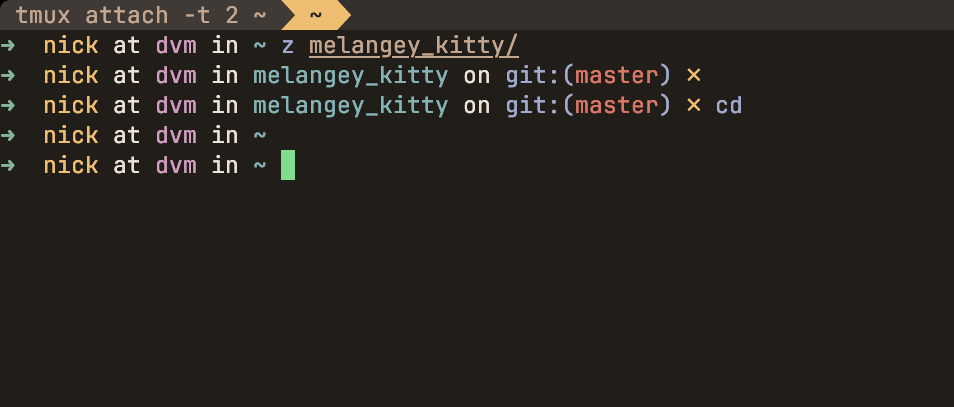

# Melangey 🐱

A warm, cozy Kitty terminal theme inspired by the beautiful [Melange](https://github.com/savq/melange-nvim) Neovim colorscheme by [savq](https://github.com/savq).



## About

Melangey brings the warm, earthy tones of the Melange colorscheme to your Kitty terminal with some thoughtful enhancements:

- **Darker background** for reduced eye strain during long coding sessions
- **Pale green cursor** for better visibility and a fresh accent
- **Dark blue selection background** for improved text selection contrast
- **Full Kitty tab support** with carefully coordinated colors
- **Complete 16-color palette** optimized for terminal applications

## Installation

### Manual Installation

1. Download the `melangey.conf` file from this repository
2. Copy it to your Kitty configuration directory:
   ```bash
   # On macOS/Linux
   cp melangey.conf ~/.config/kitty/
   
   # On macOS (alternative location)
   cp melangey.conf ~/Library/Preferences/kitty/
   ```
3. Include the theme in your `kitty.conf`:
   ```
   include melangey.conf
   ```
4. Reload Kitty configuration: `Ctrl+Shift+F5` (or `Cmd+Shift+F5` on macOS)

### Using Kitty Themes Kitten

If you have the `kitty-themes` repository cloned:

```bash
# Clone the theme into your kitty themes directory
git clone https://github.com/owlfacegames/melangey-kitty ~/.config/kitty/themes/melangey

# Apply the theme
kitty +kitten themes --reload-in=all Melangey
```

## Features

### Color Palette

Melangey provides a carefully balanced 16-color palette:

| Color   | Normal  | Bright  | Description |
|---------|---------|---------|-------------|
| Black   | #292522 | #867462 | Dark brown tones |
| Red     | #D47766 | #BD8183 | Warm coral reds |
| Green   | #85B695 | #78997A | Sage greens |
| Yellow  | #EBC06D | #E49B5D | Golden yellows |
| Blue    | #A3A9CE | #7F91B2 | Soft lavender blues |
| Magenta | #CF9BC2 | #B380B0 | Dusty roses |
| Cyan    | #89B3B6 | #7B9695 | Muted teals |
| White   | #ECE1D7 | #C1A78E | Warm whites |

### Key Modifications from Original Melange

- **Background**: Darkened to `#211d19` for better contrast
- **Cursor**: Changed to pale green (`#84de8b`) for improved visibility
- **Selection**: Dark blue (`#071afb`) background for better text selection
- **Tab Support**: Full integration with Kitty's tab bar styling

### Special Features

- **Mark Support**: Three different mark colors for highlighting text
- **Border Colors**: Active and inactive window border styling
- **Cross-platform**: Works on macOS, Linux, and Windows
- **Wayland/macOS Integration**: System titlebar color integration

## Configuration Tips

### Recommended Font Pairings

Melangey looks great with these fonts:
- **JetBrains Mono**
- **Fira Code**
- **Cascadia Code**
- **SF Mono** (macOS)
- **Consolas** (Windows)

### Kitty Settings

For the best experience with Melangey, consider these additional Kitty settings:

```conf
# Font configuration
font_family      JetBrains Mono
font_size        14.0
modify_font      cell_height 110%

# Cursor configuration
cursor_shape     block
cursor_blink_interval 0

# Tab bar
tab_bar_edge     top
tab_bar_style    powerline
tab_powerline_style slanted

# Window layout
window_padding_width 8
```

## Screenshots

The theme works beautifully with various applications:

- **Code editors**: Syntax highlighting looks crisp and readable
- **System tools**: `ls`, `git`, `htop` all display with proper color distinction
- **Development**: Perfect for long coding sessions with reduced eye strain

## Contributing

Found an issue or want to suggest improvements? Feel free to:

1. Open an issue
2. Submit a pull request
3. Share your screenshots using the theme!

## Credits

This theme is inspired by and based on the excellent [Melange](https://github.com/savq/melange-nvim) colorscheme for Neovim, created by [savq](https://github.com/savq). All credit for the original color palette and design philosophy goes to the Melange project.

## License

This theme is released under the same license as the original Melange colorscheme. Please refer to the [original repository](https://github.com/savq/melange-nvim) for licensing details.

---

*Enjoy your cozy terminal experience! 🌅*